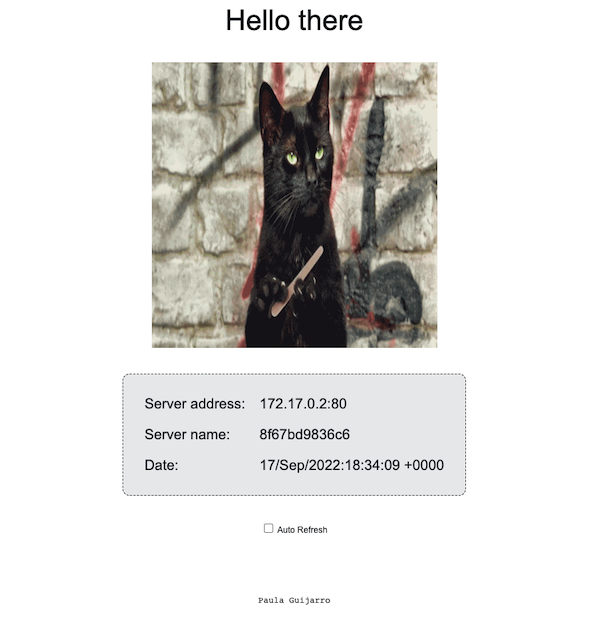
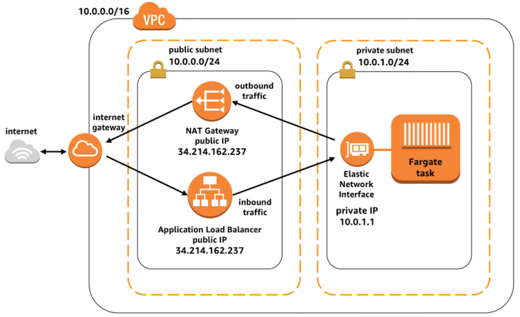

# Terraform AWS ECS Fargate

This repository contains the terraform code to deploy an application to AWS ECS Fargate and make the web app accessible from the Internet.

## What’s in the repository

You will find a sample application that displays different cat gifs every time the page is reloaded (who doesn't like cat gifs?), along with information about the server address, hostname, and date.
This last information will help us to identify, in case we have several containers serving the application, which of them, behind the ALB, is responding to our request.



The application consists of an Nginx server and some HTML, CSS, and JS files. An image can be built using the Dockerfile.

Apart from this, you will find the Terraform code needed to create all the necessary AWS infrastructure: ECR, ECS, ALB, and so on. More details can be found [in a following section](#resources-and-architecture).

The structure of the files within this repository is as follows:

```text
.
├── README.md
├── docs                    # Images used in the documentation
│   └── ...
├── Dockerfile
├── upload-image.sh         # Bash script to push the Docker image to AWS ECR
├── app                     # Web application folder
│   ├── conf                # Nginx configuration
│   │   └── app.conf
│   └── src                 # Web App files
│       ├── index.html
│       ├── scripts.js
│       └── styles.css
├── modules                 # Terraform modules for AWS 
│   ├── alb
│   │   ├── inputs.tf
│   │   ├── main.tf
│   │   └── outputs.tf
│   ├── ecr
│   │   └── ...
│   ├── ecs
│   │   └── ...
│   ├── iam
│   │   └── ...
│   ├── security_group
│   │   └── ...
│   └── vpc
│       └── ...
├── main.tf                 # Root Terraform file from which the terraform modules are called
├── backend.tf              # To configure Terraform backend (not used now)
├── providers.tf            # Terraform providers
├── variables.tf            # Terraform variables
├── secrets.tfvars          # Terraform secrets file, this is not uploaded to the repo
└── secrets.example.tfvars  # Copy of the Terraform secrets file, to use as a template
```

## How to use it

In this section, we will see how to setup the environment and deploy the code to have the application deployed and accessible from the internet.

### Setup local environment

This code uses the AWS terraform provider to interact with the resources. You must configure the provider with the proper credentials before you can use it.

#### Prerequisites

* [AWS account](https://aws.amazon.com/)
* [AWS credentials](https://docs.aws.amazon.com/IAM/latest/UserGuide/id_credentials_access-keys.html#Using_CreateAccessKey): get IAM user with access and secret keys, and the required permissions to create the AWS resources
* [Terraform](https://www.terraform.io/): This repo is compatible with terraform version `1.2.0`. You can use `tfenv` tool to manage multiple versions of terraform

  ```bash
  brew install tfenv
  tfenv install 1.2.0
  tfenv use 1.2.0
  ```

* Secrets file: You can find a template [here](secrets.example.tfvars). You can rename it to `secrets.tfvars` and fill it with your AWS keys. You can skip this, and Terraform will prompt you for the missing variables when you run it.
* Fill the variables:
Within [variables.tf file](variables.tf) custom the AWS region and the Availability Zones where you want to deploy the resources. By default, the `eu-west-1` region and its three AZs are used.
If you are not sure which AZs are available for a certain region you can use this AWS CLI command: `aws ec2 describe-availability-zones --region <aws-region>`
* Customize, if necessary, the local variables set within the [main.tf file](main.tf): (name, container and host port, cpu, memory, desired services...)

> **NOTE:** With the current configuration we would be storing the terraform state in our local. If you have configured a remote backend as an S3 bucket, you can complete the configuration in the [backend file](backend.tf).

### Deploy

We are now ready to create the resources on AWS and deploy the application.

#### Infrastructure: Terraform

Run the following command to create the AWS resources:

```bash
terraform init                              # Initialize your local terraform and download the providers
terraform plan -var-file="secrets.tfvars"   # Create a plan with the changes Terraform has to apply
terraform apply -var-file="secrets.tfvars"  # Execute the changes
```

#### Update the webapp: Docker

Here you can find the commands to push the image to the [registry in AWS](https://docs.aws.amazon.com/AmazonECR/latest/userguide/getting-started-cli.html). To facilitate this process, a [simple script](upload_image.sh) has been added to this repo with the necessary commands. To run the script you will need to have the [AWS CLI](https://aws.amazon.com/cli/) configured. You can follow [the docs](https://docs.aws.amazon.com/cli/latest/userguide/getting-started-install.html) to install it.

```bash
brew install aws-cli
```

Once you have AWS CLI, you can [configure](https://docs.aws.amazon.com/cli/latest/userguide/cli-configure-quickstart.html) your credentials:

```text
$ aws configure
AWS Access Key ID [None]: <Set the Access Key ID you got when configuring the prerequisites>
AWS Secret Access Key [None]: <Set the Secret Access Key you got when configuring the prerequisites>
Default region name [eu-west-1]:
Default output format [json]:
```

Now run the [script](upload_image.sh), it will prompt you for the `AWS ACCOUNT ID`, the `region`, and the `repo name`.

```text
$ ./upload-image.sh
AWS ACCOUNT ID:
AWS Region [eu-west-1]:
Repository name [test-repo]:
```

The Docker image will be built and uploaded to the Elastic Container Registry created with the Terraform code.

#### Access the application

Now you can look up the DNS of your ALB to verify that your service is running and accessible from the internet. This will look something similar to `<your-name>-alb-<id>.<your-region>.elb.amazonaws.com`

#### Remove AWS resources

Finally, if you want to remove all AWS resources created by Terraform, simply use the following command:

```bash
terraform destroy -var-file="secrets.tfvars"
```

## Resources and Architecture

This terraform code creates the following AWS resources:

* VPC
* A private and a public subnet per each Availability Zone
* Internet Gateway
* Routing tables
* NAT gateways with EIPs
* Security groups, one for the ALB and one for the ECS Task
* ALB and target group
* ECR for the Docker images
* ECS
  * Cluster
  * Task Definition (and IAM execution role)
  * Service

The network architecture decided to build the AWS ECS Fargate is the following: the container runs in a Fargate task in a private subnet, the ALB in the public subnet routes HTTP requests to the task, and the response comes via the NAT gateway in the public subnet. This configuration allows our tasks in Fargate to be safely isolated from the rest of the internet.

ECS integrates tightly with AWS load balancers by automatically configuring a service-linked load balancer to send network traffic to containers that are part of the service. When each task starts, the IP address of its elastic network interface is added to the load balancer’s configuration. When the task is being shut down, network traffic is safely drained from the task before removal from the load balancer.



An explanation and more information about this network architecture can be found on the [AWS blog](https://aws.amazon.com/de/blogs/compute/task-networking-in-aws-fargate/).

With the current Terraform configuration, will be created an ECS cluster with a single service, mapped to a task definition, and two containers/task running. We can change the number of the running container by changing the `service_desired_count` variable.

It is currently set to two containers so that we can check that they are on different private subnets. In the `ecs` Terraform module it can be seen the configuration for the service, like the network configuration. Refreshing the web will show that the requests are balanced between the two containers. It will be easy to identify this thanks to the data provided by the deployed web app.

In the next section, we will see how to make our architecture more scalable by configuring autoscaling as well.

## Next steps

Here is a list of the next steps to improve the architecture, the workflow, and make the service observable and reliable.

* Using separate **environments**: at this time, we are not splitting resources by environment. This can be easily done by changing the folder structure of the repo. To do this `backend.tf`, `providers.tf`, `variables.tf` and `main.tf` files should be moved from the root of the repo to a different folder. See the example below.
Splitting this will allow us to use different Terraform states for each environment and have different settings/variables for each environment. Terraform commands should be run from the different environment folders instead of the repo root.
  * Environments
    * prod
      * `backend.tf`
      * `variables.tf`
      * `main.tf`
      * `providers.tf`
    * stage
      * `backend.tf`
      * `variables.tf`
      * `main.tf`
      * `providers.tf`
    * dev
      * ...
* **Remote Backend**: with the current configuration the Terramoform state is only saved in our local. This is not a best practice. One way to use a remote backend is to make use of an S3 bucket and a DynamoDB table as a lock. These resources for managing the state can be created directly from the AWS Console or using Terraform. Here is a brief [example made by me using Terraform](https://github.com/paulaguijarro/terraform-aws-state).
Once the S3 bucket and the DynamoDB table are created, you can fill [this file](backend.tf) to start using it.
* **Lifecycle policy** in ECR: [a policy](https://registry.terraform.io/providers/hashicorp/aws/latest/docs/resources/ecr_lifecycle_policy) can be added to the ECR repository. A code example has been already added to the [`ecr` module](modules/ecr/main.tf) but is not being used at this time:

```text
resource "aws_ecr_lifecycle_policy" "policy" {
  repository = aws_ecr_repository.repository.name  policy = jsonencode({
    rules = [{
      rulePriority = 1
      description  = "keep last 5 images"
      action = {
        type = "expire"
      }
      selection = {
        tagStatus   = "any"
        countType   = "imageCountMoreThan"
        countNumber = 5
      }
    }]
  })
}
```

* Add a **HTTPs listener** to the ALB: another feature to improve the current architecture would be adding an ALB HTTPs listener. The HTTP listener would redirect to the HTTPs, and this one directs the traffic to the target group. The Terraform code to implement this has been already added, except for the certificate. Uncomment the code to start using it:

```text
modules/alb/inputs.tf:

variable "tls_cert_arn" {
  description = "The ARN of the certificate that the ALB uses for https"
}

Use the variable and pass the arn of the certificate when calling the module

modules/alb/main.tf:

resource "aws_alb_listener" "http" {
  load_balancer_arn = aws_lb.this.id
  port              = 80
  protocol          = "HTTP"

  # default_action {
  #   type = "redirect"

  #   redirect {
  #     port        = 443
  #     protocol    = "HTTPS"
  #     status_code = "HTTP_301"
  #   }
  # }

  # resource "aws_alb_listener" "https" {
  #   load_balancer_arn = aws_lb.this.id
  #   port              = 443
  #   protocol          = "HTTPS"

  #   ssl_policy      = "ELBSecurityPolicy-2016-08"
  #   certificate_arn = var.tls_cert_arn

  #   default_action {
  #     target_group_arn = aws_alb_target_group.this.id
  #     type             = "forward"
  #   }
  # }

Uncomment the redirect block to start redirecting the traffic to the HTTPs listener
Add the aws_alb_listener resource for HTTPs
HTTP listener will redirects to the HTTPS listener, which sends traffic to the target group
```

* **Autoscaling**: To make this architecture more reliable, autoscaling can be added to the service. We add the following code to, for example, defined that the maximum number of tasks to be run should be 4, and at least 1 task should be running at all times.

```text
aws_appautoscaling_target: https://registry.terraform.io/providers/hashicorp/aws/latest/docs/resources/appautoscaling_target

resource "aws_appautoscaling_target" "ecs_target" {
  max_capacity       = 4
  min_capacity       = 1
  resource_id        = "service/${aws_ecs_cluster.example.name}/${aws_ecs_service.example.name}"
  scalable_dimension = "ecs:service:DesiredCount"
  service_namespace  = "ecs"
}

Different autoscaling policies can be added to scale the number of tasks, for example, based on memory or cpu utilization.
```

* **Pipeline**: build and push Docker image to AWS ECR using Github Actions.
Go to your GitHub repository and click on `Actions`
Click on the set-up a workflow yourself and add the file name, for example, `deploy.yml`.
Add the code and when finished click on `start commit`
Add your AWS secrets to Github secrets

```text
# Github actions example:

name: Deploy Docker image to ECR
on:
  push:
    branches: [ main ]
jobs:
  build:
    name: Build Image
    runs-on: ubuntu-latest
    steps:
    - name: Check code
      uses: actions/checkout@v2
    - name: Configure AWS credentials
      uses: aws-actions/configure-aws-credentials@v1
      with:
        aws-access-key-id: ${{ secrets.AWS_ACCESS_KEY_ID }}
        aws-secret-access-key: ${{ secrets.AWS_SECRET_ACCESS_KEY }}
        aws-region: eu-west-1
    - name: Login to Amazon ECR
      id: login-ecr
      uses: aws-actions/amazon-ecr-login@v1
    - name: Build, tag, and push image to Amazon ECR
      env:
        ECR_REGISTRY: ${{ steps.login-ecr.outputs.registry }}
        ECR_REPOSITORY: test-repo
        IMAGE_TAG: latest
      run: |
        docker build -t $ECR_REGISTRY/$ECR_REPOSITORY:$IMAGE_TAG .
        docker push $ECR_REGISTRY/$ECR_REPOSITORY:$IMAGE_TAG
```

* **Monitoring**: add monitoring to the service. There are many different tools to monitor the resources deployed in this repo. Amazon Cloudwatch, Datadog, Prometheus... This section is beyond the scope of this README, but adding the proper tools to help us know the status of our service would be a must
* Terraform [pre-commit](https://github.com/antonbabenko/pre-commit-terraform) hooks: some tools can make your Terraform repo remains well formatted and configured. Incorporate Git pre-commit hooks in the code workflow.
  * Install pre-commit: `brew install pre-commit`
  * Install third party tools if needed: tflint, tfsec...
  * In the root of the repo, add a file called `.pre-commit-config.yaml` with the configuration
  * Execute `pre-commit run -a` to run pre-commit on all files in the repo
  * Find [more info here](https://github.com/antonbabenko/pre-commit-terraform#table-of-content)
